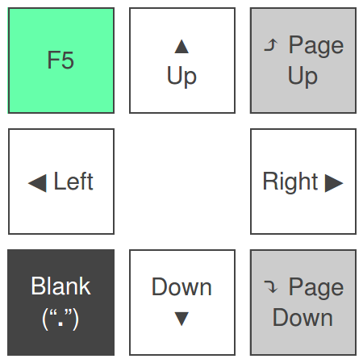

# LAN Presenter

This software enables you to control your presentation remotely from a smartphone,
or an other computer with a browser.

It has a web user interface, that looks like this:

__SECURITY WARNING:__ This software provides absolutely __no__
authentication, authorization, or encryption.
_Anybody_ on your network will be able access the remote control functionality.

Supported operating systems:
* Linux (must be run as root)
* Windows

## How to use

You will need Python (3.6+) and PIP to install this software.
You can install it with:

    pip install lan_presenter

After installation you can run it with:

    lan_presenter
